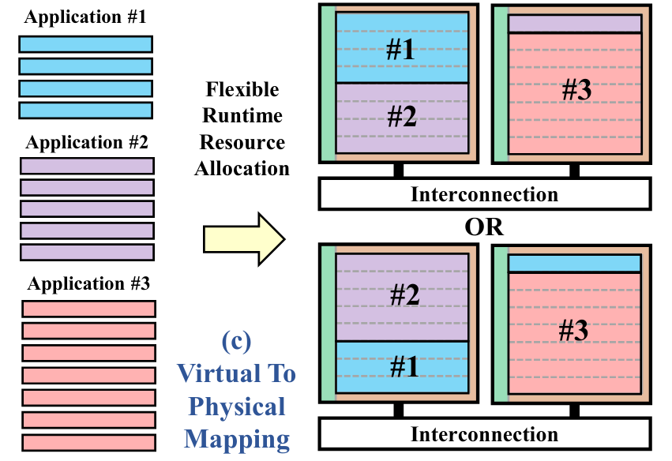
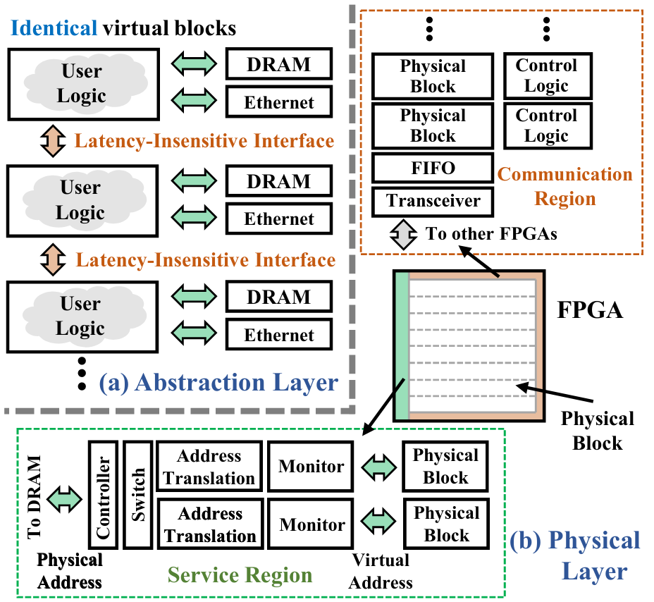
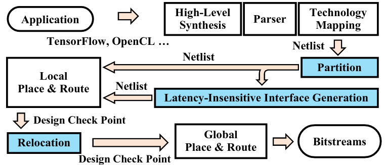
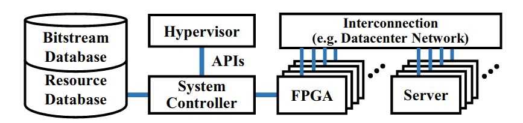
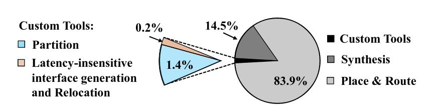
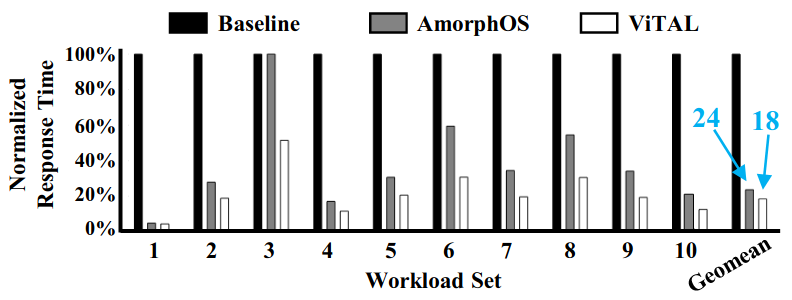

## Outline

- Introduction
  - [Objectives](#objectives)
  - [Existing Solutions](#existing-solutions)
- Methods
  - [System Overview](#system-overview)
  - [Architecture](#architecture-layer) [Compilation](#compilation-layer), and [System Layer](#system-layer)
- Evaluation
- Conclusion

# Introduction

## Objectives

Simultaneously solve 2 problems:

1. Bad utilization
   - Cloud providers currently allocate **physical FPGA** for user app
   - Causes **internal fragmentation**
2. Scaling up is difficult (for software devs)
   - Vendor tools focuses on single-device programming
   - Devs have to:
     - Manually partition app into multiple FPGAs
     - Manually handle inter-FPGA communication

## Existing Solutions

Problems to solve: (1) Bad utilization (2) Difficult to use multi-FPGA

- The overlay architecture
  - Create "abstract FPGA" on top of different FPGAs
  - Analogous to JVM for software
  - Does not solve (1)
- Slot-based method
  - Analogous to MIG for GPU
  - Does not solve (2)
- AmorphOS
  - 2 modes: slot-based and combined-compile
  - Does not solve (2)

# Methods

## Overview of ViTAL \normalsize{}(Virtulization Stack for FPGAs in the Cloud)

- Carefully divide FPGA into identical \textcolor{blue}{physical blocks}
- Compile apps into \textcolor{red}{virtual blocks}
- Map \textcolor{red}{virtual blocks} to \textcolor{blue}{physical blocks} at runtime (1-to-1)
- **Runtime allocation** $\implies$ Good utilization
- Illusion of **single, infinitely large FPGA** $\implies$ Good scale-out

<!-- ## Programming Model

- **Single, infinitely large FPGA**
- "Portable across FPGAs"
- Reduces programming complexity
  - ViTAL takes care of partitioning & communication
  - Supports C/C++/OpenCL/other DSLs (by using HLS) -->

## Architecture Layer

- **Homogeneous abstraction**: *User region* blocks are the same
- *Service* and *communication* region for interconnection

## Compilation Layer

1. Synthesis (HLS $\to$ RTL $\to$ Netlist)
2. **Partition**
   - Into virtual blocks
   - Done at the **netlist level** for **max resource usage**
3. Communication interface generation
4. P&R and Relocation (at runtime)

## System Layer

<!-- - Uses *partial reconfiguration* to deploy virtual blocks -->
- Tries to allocate blocks from **single FPGA** for one app
  - ... then 2 FPGAs, then 3 FPGAs, ...
  - Lowers communication overhead within app
- DRAM access is virtualized & managed (for isolation)

# Evaluation

3 sets of benchmarks

1. Small synthetic task
   - Evaluates bandwidth in *architecture layer*
   - $94$ Gb/s (inter-FPGA), $312.5$ Gb/s (inter-die)
   - Resource usage of communication region $< 10\%$
2. Deep learning task
   - Evaluates *compilation & relocation time*

   

## Evaluation (cont'd)

3 sets of benchmarks

3. Multiple deep learning tasks
   - Tasks come at random time
   - Simulates cloud environment
   - $82\%$ better than not sharing at all
   - $25\%$ better than AmorphOS ($\because$ multi-FPGA)

# Conclusion

- Decouple **compilation** and **resource allocation** for FPGA
- Provides **single large FPGA** illusion to devs
- Achieves higher utilization & lower response time

- My thoughts
  - The claimed "portability" is false
  - Portability can be solved by **combining overlay architecture** on top of ViTAL
  - The system is applicable to non-FPGA accelerators

# References

- Yue Zha and Jing Li. 2020. Virtualizing FPGAs in the Cloud. Proceedings of the Twenty-Fifth International Conference on Architectural Support for Programming Languages and Operating Systems. Association for Computing Machinery, New York, NY, USA, 845–858. https://doi.org/10.1145/3373376.3378491
- Quraishi, Masudul Hassan and Tavakoli, Erfan Bank and Ren, Fengbo. 2020. A Survey of System Architectures and Techniques for FPGA Virtualization.
